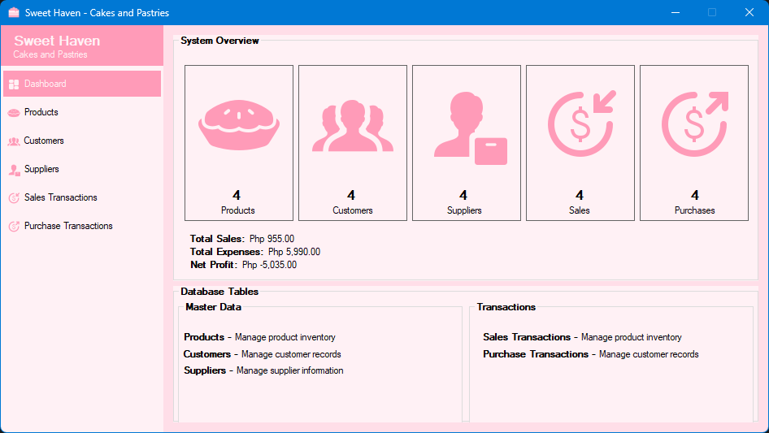
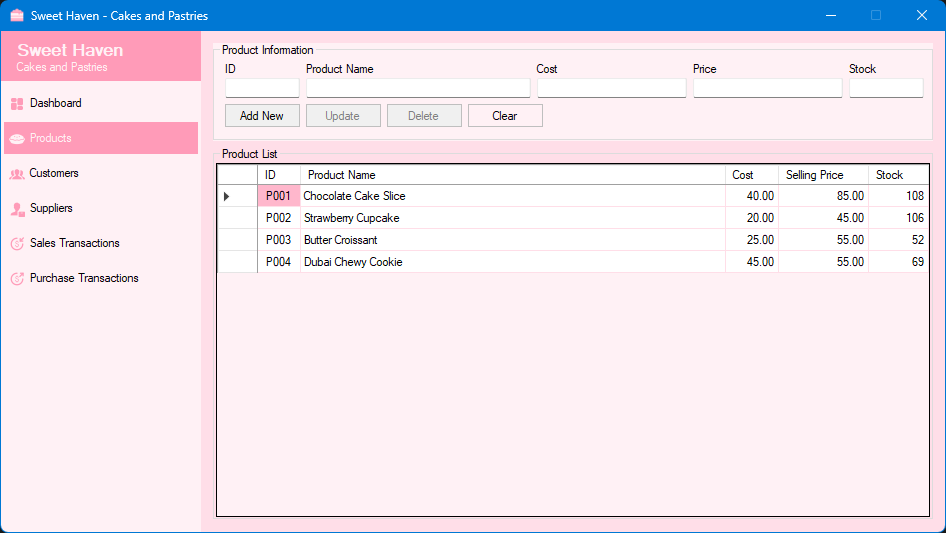
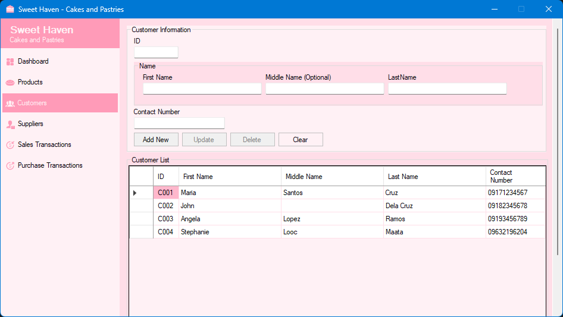
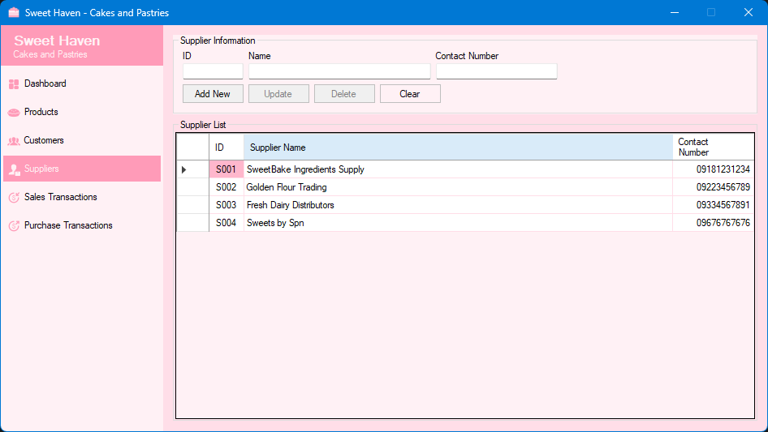
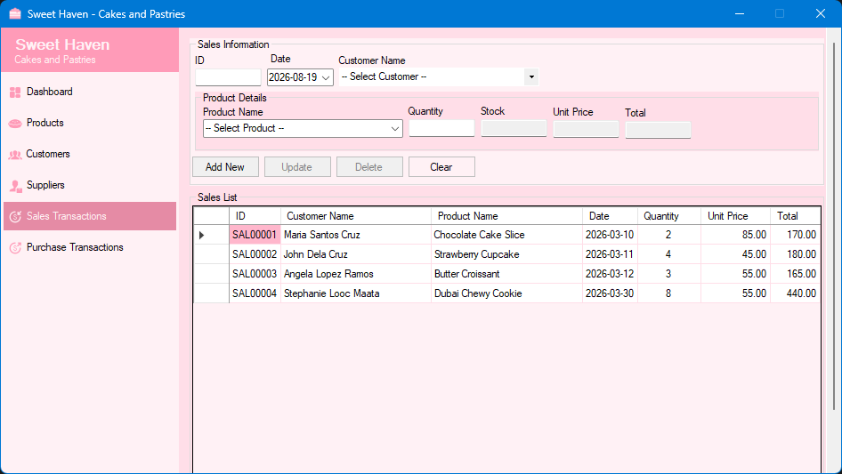
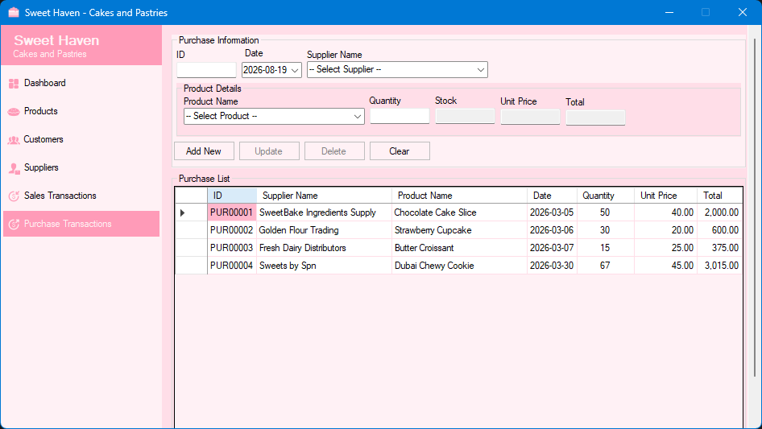

# SweetHaven Cakes and Pastries

A Windows desktop **point-of-sale (POS) and inventory system** for a bakery. It tracks products, customers, suppliers, sales, and purchases against a shared MySQL database from a single dashboard.

This is the final project for **CCS 5 (Fundamentals of Information Management)** at Silliman University College of Computer Studies. It's a learning project built to practice database interaction, so everything in it is driven by SQL against a live MySQL server.

## Screenshots

## What it does

A desktop app where every screen reads and writes to the same MySQL database:

- **Dashboard** — live counts for each module plus computed totals: revenue from sales (`quantity × selling price`), and spend from purchases (`quantity × cost`), all summed in SQL
- **Products** — inventory with cost, selling price, and stock, linked to their suppliers
- **Customers** — a searchable record of everyone who orders
- **Suppliers** — who supplies each ingredient or product
- **Sales & Purchases** — record transactions; quantities flow into stock and the dashboard totals

Every module supports full add / update / delete / clear operations against MySQL, so all screens share one source of truth.

## Design highlights

This was designed **database-first** rather than UI-first:

- **ADO.NET the classic way.** Forms load through `MySqlDataAdapter` + `DataSet`, and each action is a `SELECT`, `INSERT`, `UPDATE`, or `DELETE` sent to the server.
- **Relationships matter.** Sales and purchases reference `product` (and products reference `supplier`); dashboard revenue/expense figures are `SUM` joins across tables, not precomputed numbers.
- **One source of truth.** Edit a product's price once and every sales record and dashboard total updates immediately.

## Tech stack

| What | Used for |
|---|---|
| VB.NET (Windows Forms, .NET Framework 4.7.2) | desktop UI and app logic |
| MySQL | the single shared `sweet_haven` database |
| MySql.Data / ADO.NET | DataAdapter, DataSet, and all CRUD queries |
| Visual Studio `.slnx` | solution and project management |
